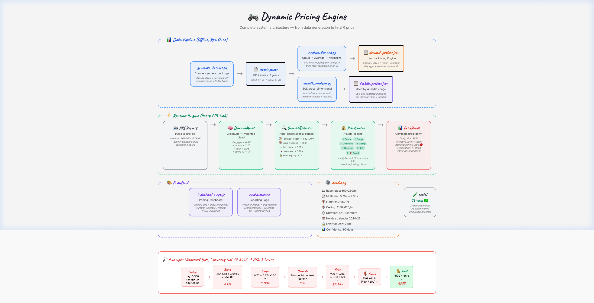
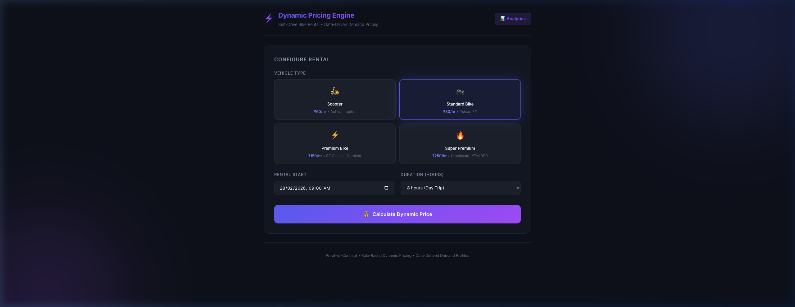
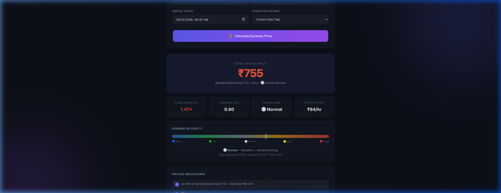
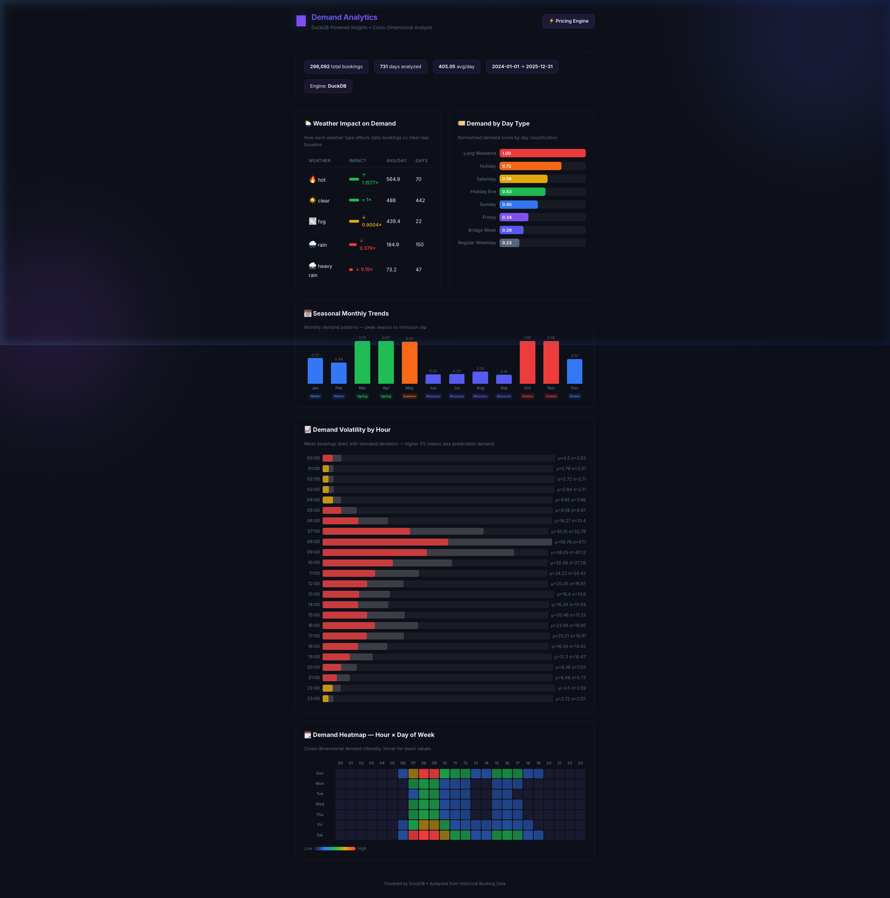

<p align="center">
  
  
  
  
  
</p>

<h1 align="center">🏍️ Dynamic Pricing Engine</h1>

<p align="center">
  <strong>A data-driven dynamic pricing engine for self-drive bike rentals.</strong><br>
  Adjusts rental prices based on demand patterns, weather, holidays, and seasonal trends.
</p>

<p align="center">
  
</p>

---

## ✨ Key Features

| Feature | Details |
|---------|---------|
| 🏍️ **4 Vehicle Tiers** | Scooter (₹60/hr) → Standard (₹80) → Premium (₹150) → Super Premium (₹250) |
| 📊 **Data-Driven Demand** | Profiles derived from 296K synthetic bookings, not hardcoded |
| 📅 **Smart Day Classification** | Long weekends, bridge days, holiday eves — 9 day types ranked by demand |
| 🎯 **5 Demand Zones** | Dead 🔵 → Low 🟢 → Normal ⚪ → High 🟡 → Surge 🔴 |
| 🔍 **Auto-Detected Overrides** | Festivals (+40%), long weekends (+50%), rain (-15%), heatwave (-10%) |
| ⏱️ **Duration Discounts** | 4+hrs → 10% off · 8+hrs → 20% off · 24+hrs → 30% off |
| 🛡️ **Price Guards** | Absolute ₹ floor (~65% of base) and ceiling (~250%) per vehicle |
| 📈 **Full Explainability** | 12-step pricing breakdown for every calculation |
| 🧪 **78 Tests** | Comprehensive test suite covering demand model, pricing engine, and analytics |

---

## 🚀 Quick Start

```bash
# 1. Clone and setup
git clone https://github.com/vidyavipul/dynamic-price-engine.git
cd dynamic-price-engine
python3 -m venv venv
source venv/bin/activate
pip install -r requirements.txt

# 2. Generate data & profiles (one-time, ~10 seconds)
python3 data/generate_dataset.py
python3 data/analyze_demand.py
python3 data/duckdb_analyzer.py

# 3. Run the server
python3 -m app.main

# 4. Open in browser
open http://localhost:8000
```

---

## 📸 Screenshots

<details>
<summary><strong>💰 Pricing Dashboard</strong> — Calculate dynamic prices with full breakdown</summary>
<br>

</details>

<details>
<summary><strong>📊 Pricing Results</strong> — Surge multiplier, demand zone, step-by-step explanation</summary>
<br>

</details>

<details open>
<summary><strong>📈 Analytics Page</strong> — Weather impact, day ranking, monthly trends, heatmap</summary>
<br>

</details>

---

## 🏗️ Architecture

```
📊 Synthetic Dataset (2yrs, 296K bookings)
        ↓
📈 Demand Analyzer ──→ demand_profiles.json (used by pricing)
        ↓
🦆 DuckDB Analyzer ──→ duckdb_profiles.json (used by analytics)
        ↓
⚡ Runtime: DemandModel → OverrideDetector → PriceEngine (7 steps)
        ↓
💰 Final ₹ Price + Step-by-step Explanation
```

### Project Structure

```
dynamic-price-engine/
├── data/                        # DATA PIPELINE (offline, run once)
│   ├── generate_dataset.py      # Step 1: Synthetic bookings (296K rows)
│   ├── analyze_demand.py        # Step 2: Compute demand profiles
│   ├── duckdb_analyzer.py       # Step 2b: Cross-dimensional analytics
│   ├── demand_profiles.json     # Output: pricing profiles
│   └── demand_profiles_duckdb.json  # Output: analytics profiles
│
├── app/                         # RUNTIME ENGINE
│   ├── config.py                # All tunable constants
│   ├── demand_model.py          # Datetime → demand score (0–1)
│   ├── overrides.py             # Auto-detect holidays, rain, festivals
│   ├── price_engine.py          # 7-step pricing pipeline
│   └── main.py                  # FastAPI server
│
├── static/                      # FRONTEND
│   ├── index.html               # Pricing dashboard
│   ├── analytics.html           # DuckDB analytics page
│   ├── architecture.html        # Interactive architecture diagram
│   ├── app.js                   # Frontend logic
│   └── style.css                # Styling
│
└── tests/                       # 78 TESTS
    ├── test_demand_model.py     # 21 tests
    ├── test_price_engine.py     # 36 tests
    └── test_duckdb_analyzer.py  # 21 tests
```

---

## ⚙️ How Pricing Works

The engine uses a **7-step pipeline** to compute the final price:

```
Step 1  📊 Demand Score      → Blend day_type (45%) + season (30%) + hour (25%)
Step 2  📈 Surge Multiplier  → Linear map: 0.70× (dead) to 2.00× (peak)
Step 3  🔍 Override Detection → Auto-detect festivals, rain, long weekends
Step 4  🔒 Clamp Multiplier  → Keep within [0.70, 2.00] bounds
Step 5  ⏱️ Duration Discount  → 4/8/24hr tiers applied after surge
Step 6  💰 Effective Rate     → base_rate × multiplier × discount
Step 7  🛡️ Price Guard        → Clamp to absolute floor/ceiling per vehicle
```

### Example: Standard Bike, Saturday Oct 18 2025, 9 AM, 8 hours

| Step | Calculation | Result |
|------|-------------|--------|
| Lookup | day=0.558, month=1.0, hour=0.89 | — |
| Blend | 0.45×0.558 + 0.30×1.0 + 0.25×0.89 | **score = 0.774** |
| Surge | 0.70 + 0.774 × 1.30 | **1.706×** |
| Override | No special context | **1.0×** |
| Rate | ₹80 × 1.706 × 0.80 (8hr discount) | **₹109/hr** |
| Guard | ₹109 within [₹50, ₹200] ✓ | — |
| **Total** | **₹109 × 8 hours** | **₹873** |

---

## 🛡️ Price Guards

Absolute ₹ floor and ceiling per vehicle prevent financial losses and overcharging:

| Vehicle | Base Rate | Floor (~65%) | Ceiling (~250%) |
|---------|-----------|-------------|-----------------|
| Scooter | ₹60/hr | ₹40/hr | ₹150/hr |
| Standard Bike | ₹80/hr | ₹50/hr | ₹200/hr |
| Premium Bike | ₹150/hr | ₹100/hr | ₹375/hr |
| Super Premium | ₹250/hr | ₹160/hr | ₹625/hr |

> Even with maximum discount stacking (dead demand + 24hr duration), the rate never drops below operational cost.

---

## 🔍 Auto-Detected Overrides

No manual input needed — the engine automatically detects:

| Override | Factor | Confidence | Trigger |
|----------|--------|------------|---------|
| 🎉 Festival (Diwali, Holi) | 1.40× | High | Holiday calendar |
| 📅 Long Weekend | 1.50× | High | 3+ consecutive off days |
| 🎊 Regular Holiday | 1.30× | High | Public holiday |
| 🌙 Holiday Eve | 1.15× | Medium | Day before a holiday |
| 🌆 Friday Evening | 1.20× | Medium | Friday after 5 PM |
| 🌧️ Rain Likely | 0.85× | Medium | Historical rain >25% |
| ⛈️ Heavy Rain | 0.70× | High | Historical heavy rain >15% |
| 🌡️ Heatwave | 0.90× | Low | Historical hot >20% |

Overrides **stack multiplicatively** and are capped at 2.0×.

---

## 📅 Smart Day Classification

Every date is classified into one of **9 demand tiers**:

```
Demand ──────────────────────────────────────────▶

🔴 long_weekend    ████████████████████████████  1.00
🟡 holiday         ████████████████████          0.72
🟢 saturday        ██████████████████            0.56
🟢 holiday_eve     █████████████████             0.53
🟢 sunday          ██████████████                0.45
⚪ friday          ██████████                    0.34
⚪ bridge_weak     ████████                      0.28
🔵 regular_weekday ██████                        0.23
```

---

## 🧪 Testing

```bash
# Run all 78 tests
python3 -m pytest tests/ -v

# Run specific test file
python3 -m pytest tests/test_price_engine.py -v
```

| Test File | Tests | Coverage |
|-----------|-------|----------|
| `test_demand_model.py` | 21 | Score bounds, weekend vs weekday, seasons, long weekends, bridges, zones, holidays |
| `test_price_engine.py` | 36 | Pricing, surge, overrides, discounts, validation, confidence, price guards |
| `test_duckdb_analyzer.py` | 21 | Profile structure, consistency, cross-dimensional, v2 scoring |

---

## 🔌 API Reference

| Method | Endpoint | Description |
|--------|----------|-------------|
| `POST` | `/api/price` | Calculate dynamic price |
| `GET` | `/api/vehicles` | List vehicle types + base rates |
| `GET` | `/api/analytics` | DuckDB analytics data |
| `GET` | `/` | Pricing dashboard |
| `GET` | `/analytics` | Analytics reporting page |

### POST `/api/price`

```json
// Request
{
  "rental_datetime": "2025-10-18T09:00:00",
  "vehicle_type": "standard_bike",
  "duration_hours": 8
}

// Response (simplified)
{
  "final_price": 873.47,
  "effective_hourly_rate": 109.18,
  "surge_multiplier": 1.706,
  "demand": { "score": 0.774, "zone": "Surge" },
  "overrides_detected": [],
  "explanation": ["🏍️ Vehicle: Standard Bike — Base rate: ₹80/hr", "..."]
}
```

---

## 🛠️ Tech Stack

| Layer | Technology |
|-------|-----------|
| **Backend** | Python 3.10+, FastAPI, Pydantic, Uvicorn |
| **Data Analysis** | DuckDB (SQL analytics), CSV processing |
| **Frontend** | Vanilla HTML/CSS/JS, dark theme, glassmorphism |
| **Testing** | pytest (78 tests) |

---

## 📄 License

MIT

---

<p align="center">
  Built with curiosity to understand dynamic pricing systems.
</p>
